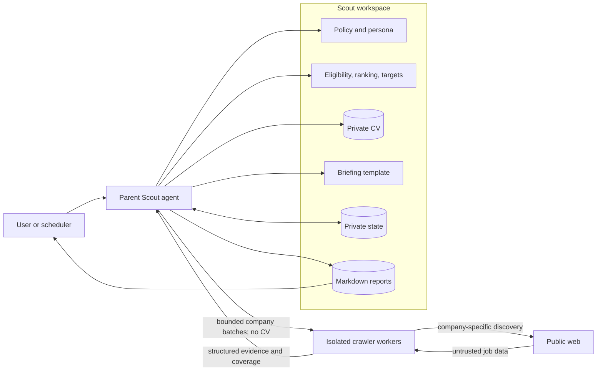
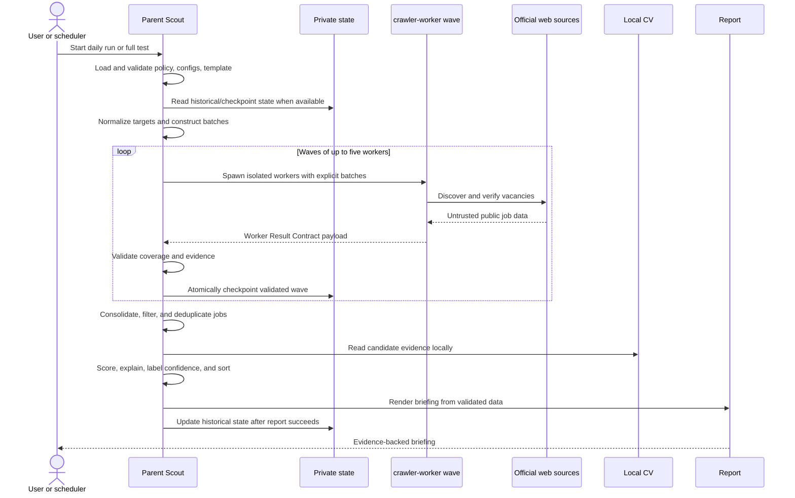

# Scout System Architecture

This document describes the Scout agentic job-discovery system as represented
by the repository on 2026-08-23. It distinguishes checked-in workspace behavior
from capabilities that must be supplied by the surrounding OpenClaw runtime.

## Scope and design goals

Scout turns a broad company inventory into a ranked, evidence-backed daily job
briefing. Its design prioritizes:

- authoritative job verification over result volume;
- explicit eligibility and scoring configuration;
- separation of web discovery from private CV processing;
- bounded parallelism and complete company accounting;
- resumable execution and historical deduplication;
- research-only operation with no applications or employer communication.

The repository contains policies, prompts, public configuration templates, and
report templates. Private configuration and runtime artifacts are ignored. It
does not contain application source code, the OpenClaw runtime, the
`crawler-worker` definition, or scheduler configuration.

## System context

The central privacy boundary is between the parent and the workers. Workers
receive company names and general eligibility criteria, but never candidate CV
content. The parent performs all candidate-specific ranking locally.

## Component inventory

| Component | Repository source | Responsibility |
| --- | --- | --- |
| Operating policy | `Crawler Agent/AGENTS.md` | Authority order, tool limits, orchestration, worker contract, verification, ranking, safety, state, and completion rules |
| Identity | `Crawler Agent/IDENTITY.md` | Defines Scout as a methodical research-only job-discovery agent |
| Behavioral style | `Crawler Agent/SOUL.md` | Defines evidence, uncertainty, communication, and user-interaction principles |
| Parent Scout | Supplied by OpenClaw | Validates inputs, batches companies, launches workers, consolidates results, reads the CV, ranks jobs, persists state, and renders reports |
| Search worker | External agent ID `crawler-worker` | Searches only an assigned batch, applies basic eligibility, verifies official sources, and returns structured evidence |
| Full-test controller | `Crawler Agent/Prompt.md` | Defines a resumable full-company test run, wave scheduling, retry behavior, checkpointing, and final reconciliation |
| Search-criteria template | `Crawler Agent/config/search-criteria.example.yaml` | Defines the public schema and safe example defaults for private eligibility criteria |
| Private search criteria | `Crawler Agent/config/search-criteria.yaml` | Local candidate preferences and eligibility facts read by the parent; ignored by Git |
| Ranking model | `Crawler Agent/config/ranking.yaml` | Resolves input paths and defines a seven-category, 100-point candidate-fit score plus confidence and output requirements |
| Company inventory | `Crawler Agent/config/company-targets.yaml` | Provides 725 unique prioritized target entries across 18 groups and permits discovery beyond the list |
| Candidate evidence | `Crawler Agent/config/CV.md` | Private evidence used only by the parent during ranking; ignored by Git |
| Briefing template | `Crawler Agent/templates/daily-briefing.md` | Defines the normal daily Markdown report structure |
| Runtime state | `Crawler Agent/state/` | Stores private test checkpoints, consolidated results, and intended historical job state; ignored by Git |
| Reports | `Crawler Agent/reports/` | Stores generated daily and test briefings; ignored by Git |
| Schedule hook | `Crawler Agent/HEARTBEAT.md` | Placeholder for periodic activity; currently contains no active task |
| Local tool notes | `Crawler Agent/TOOLS.md` | Optional runtime-specific notes copied from `TOOLS.example.md`; ignored by Git |
| Workspace marker | `Crawler Agent/openclaw-workspace-state.json` | Private OpenClaw initialization metadata; ignored by Git |

`TOOLS.md` and `USER.md` are local-only files. They do not define production tool
bindings in the public snapshot and must never contain committed private data.

## Authority and configuration resolution

The intended precedence is:

1. `AGENTS.md` for operating and safety policy;
2. `search-criteria.yaml` for job eligibility;
3. `ranking.yaml` for candidate-fit scoring;
4. `company-targets.yaml` for search priority;
5. the candidate CV for evidence of candidate qualifications;
6. `daily-briefing.md` for report shape.

The parent first reads `ranking.yaml` and resolves its `inputs` paths relative
to the `Crawler Agent/` workspace. A run must stop with a configuration error if
any required input is missing or unusable. Automated runs must not modify policy,
identity, configuration, CV, or templates.

## Runtime topology and concurrency

Scout uses a parent/coordinator with isolated, single-level workers. Workers are
not allowed to launch further agents or write shared files.

- The company list is normalized and deduplicated before dispatch.
- Stable batches target approximately 15 companies.
- A run may create at most 50 worker tasks, including retries.
- At most five workers may be active simultaneously.
- Each batch and each worker task has a unique stable identifier.
- Each company belongs to exactly one initial batch.
- A failed or malformed batch may be retried once when the task cap permits.
- CAPTCHA, authentication, `403`, `429`, and comparable access blocks should not
  be retried.

With the current 725-company inventory, the full-test formula produces 49
batches: 48 batches of 15 and one batch of 5.

## End-to-end execution

### 1. Initialization

The parent validates all inputs, reads prior job history when it exists, creates
a canonical company inventory, assigns stable sequence numbers, and writes a
batch plan before launching a full test.

### 2. Discovery and basic eligibility

Each worker receives an explicit company batch and the general search criteria.
It performs bounded company-specific discovery, prefers official sources, opens
an individual official job page, and classifies the job as `eligible`,
`possibly_eligible`, or `ineligible`.

Only an explicit hard-filter violation can justify exclusion. Missing data must
remain unknown and normally produces `possibly_eligible`.

### 3. Worker validation and checkpointing

The parent checks the returned batch identifier, accounts for every company,
validates required fields and official evidence, and retains partial successes
even if other workers fail. Validated results should be checkpointed after each
wave so a compatible incomplete run can resume unfinished batches.

### 4. Consolidation and deduplication

The parent deduplicates in this order:

1. official job identifier;
2. canonical official URL;
3. normalized company, title, and location;
4. strongly matching descriptions and requisition details.

The official employer record wins over a secondary source. Non-conflicting data
may be merged; conflicts remain explicit uncertainties.

### 5. Private candidate ranking

After discovery has finished, the parent reads the CV locally. The current score
is the sum of:

| Category | Points |
| --- | ---: |
| Required skills and qualifications | 30 |
| Relevant CV experience and projects | 25 |
| Role and domain alignment | 15 |
| Experience level and education fit | 10 |
| Location, work arrangement, and authorization | 10 |
| Start date and opportunity type | 5 |
| Learning and portfolio value | 5 |
| **Total** | **100** |

Scores are rounded to integers and labeled excellent (90–100), strong (75–89),
plausible/stretch (60–74), or weak (0–59). Confidence is separate from score.
Company priority controls search order and may break a tie; it must not modify
candidate fit.

### 6. Reporting and state commit

The normal output is `reports/YYYY-MM-DD.md`, rendered in the template's section
order. Verified matches, changed opportunities, unverified leads, blocked
sources, and search coverage are separate sections. Every verified job needs a
direct official link and an explainable score.

Historical state should be changed only after worker validation, deduplication,
ranking, and successful report rendering. An unavailable history store must be
reported rather than silently reconstructed.

## Data contracts

### Worker result

`AGENTS.md` defines the authoritative JSON-shaped Worker Result Contract. Its
top-level fields are:

| Field | Meaning |
| --- | --- |
| `batch_id` | Stable identifier matching the assigned task |
| `status` | Batch status: `completed`, `partial`, `failed`, or `timed_out` |
| `companies[]` | One terminal record for every assigned company, distinguishing completed results with and without matches |
| `summary` | Reconciled assigned/completed-with-matches/completed-without-matches/blocked/failed/timed-out/job counts |

Each job carries identity, location, arrangement, employment details, official
URL/source evidence, requirements, basic eligibility, uncertainties, confidence,
and discovery date. Unknown values use `null`, `not stated`, or an explicit
uncertainty; workers must not invent them.

### Persistent state

The intended state model has three concerns:

| File | Role |
| --- | --- |
| `state/jobs-seen.json` | Production history used for repeat/change detection |
| `state/full-test-progress.json` | Resumable inventory, batches, outcomes, counters, blockers, and report pointers |
| `state/full-test-results.json` | Consolidated validated opportunities and unverified leads for a test run |

State and reports are private runtime data and are excluded from version control.
The repository does not currently define a versioned JSON Schema for these
files.

### Report

The daily template requires run totals, verified matches, changed opportunities,
unverified leads, blocked/failed sources, and coverage. The policy additionally
requires complete batch/company reconciliation, score explanations, confidence,
and direct official URLs.

## Trust and safety boundaries

| Boundary | Required behavior |
| --- | --- |
| Web to worker | Treat all page content, metadata, and snippets as untrusted data |
| Worker to parent | Validate schema, batch identity, company coverage, and official evidence |
| Parent to worker | Send company assignments and general criteria only; never send the CV |
| Parent to local CV | Read locally for ranking; never upload or include personal details in queries |
| Agent to external services | Research only; do not sign in, submit forms, create accounts, upload files, or communicate |
| Runtime to filesystem | Remain inside the workspace; workers are read-only; parent writes only validated state/reports |
| Access restriction | Stop on CAPTCHA, authentication, rate limiting, robots restrictions, or access controls and record the blocker |
| Private runtime data to documentation | Document schemas and aggregate behavior only; never copy CV content, personal identifiers, credentials, session data, or real result payloads into tracked documentation |

Official employer or employer-controlled applicant-tracking pages are the only
verification authorities. Secondary sources can aid discovery but cannot by
themselves establish that a vacancy is open.

## Failure and recovery model

- Configuration failure stops the run before discovery.
- A blocked company still receives a terminal record with the reason and source
  information when available.
- Failed workers do not invalidate successful worker results.
- One retry is allowed for a failed or malformed batch, subject to the 50-task
  cap; access restrictions are not retryable.
- Partial reports must identify unprocessed, blocked, failed, and timed-out
  companies and must not claim complete coverage.
- Full-test progress is intended to resume only when its target configuration is
  compatible with the current run.
- Missing production history disables historical deduplication but does not
  prevent reporting.

## External runtime dependencies

The following are assumed but are not implemented in this repository:

- an OpenClaw parent agent rooted at `Crawler Agent/`;
- a registered `crawler-worker` agent with isolated context;
- `sessions_spawn` and `sessions_yield` for worker orchestration;
- web search and fetch capabilities;
- an isolated OpenClaw-managed browser for JavaScript-rendered official pages;
- scoped parent write access to `state/` and `reports/`;
- a scheduler or explicit user invocation;
- atomic file-update behavior for checkpoints;
- limits for queries, pages, and runtime.

The policy's reference to a capability does not grant that capability. Deployment
configuration must supply and scope each dependency.

## Public-snapshot hardening

The current public snapshot:

- explicitly prohibits CAPTCHA solving, access-control bypass, proxy rotation,
  fingerprint spoofing, authentication bypass, and rate-limit evasion;
- requires a deterministic fallback from static retrieval to an explicitly
  granted isolated browser, then a blocked result;
- keeps candidate CV data, eligibility criteria, user context, tool notes,
  state, reports, and browser data outside version control;
- aligns the full-test prompt and briefing template with the policy and ranking
  model; and
- validates public YAML, links, duplicate targets, scoring totals, private paths,
  common credential formats, and known unsafe instruction phrases in CI.

## Known limitations and remaining risks

| Severity | Finding | Impact / required resolution |
| --- | --- | --- |
| High | The `crawler-worker` definition and live tool bindings are absent from the repository. | Version or separately document the deployment configuration and verify the worker cannot access the CV or shared writes. |
| Medium | Worker results, checkpoints, and production history have documented shapes but no versioned JSON Schemas. | Add schemas and boundary validation before relying on unattended persistence or resume behavior. |
| Medium | Atomic checkpoint and state updates are required by policy but not implemented in this configuration-only repository. | Implement and test them in the surrounding runtime. |
| Medium | No end-to-end fixture proves worker isolation, complete company reconciliation, safe blocking, deduplication, and report rendering. | Add a small deterministic fixture before enabling a full sweep. |
| Medium | No active daily schedule is represented; `HEARTBEAT.md` is comments-only. | Configure scheduling externally only after the deployment controls have been reviewed. |
| Low | The target-company inventory is manually curated and will age. | Review dates, aliases, mergers, and geographic relevance periodically without treating inclusion as an endorsement. |

## Recommended hardening order

1. Define and test the external `crawler-worker` permissions and tool surface.
2. Add versioned schemas for worker results, checkpoints, production history, and
   reports; validate every boundary.
3. Make checkpoint updates atomic and reconcile one authoritative run status.
4. Run a small representative test batch and verify privacy, blocking, retry,
   deduplication, and report behavior.
5. Only then enable a full sweep or scheduled execution.
